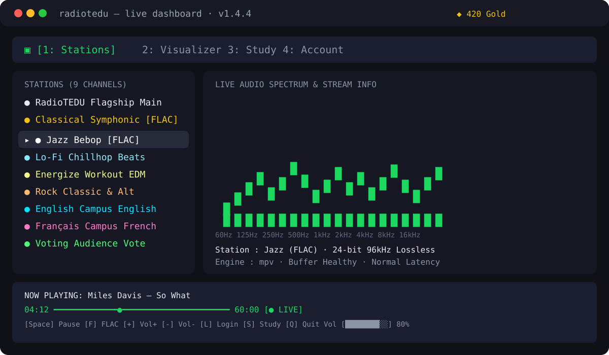
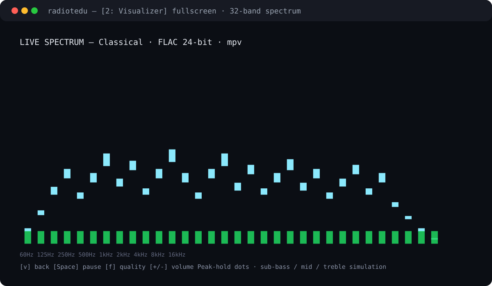
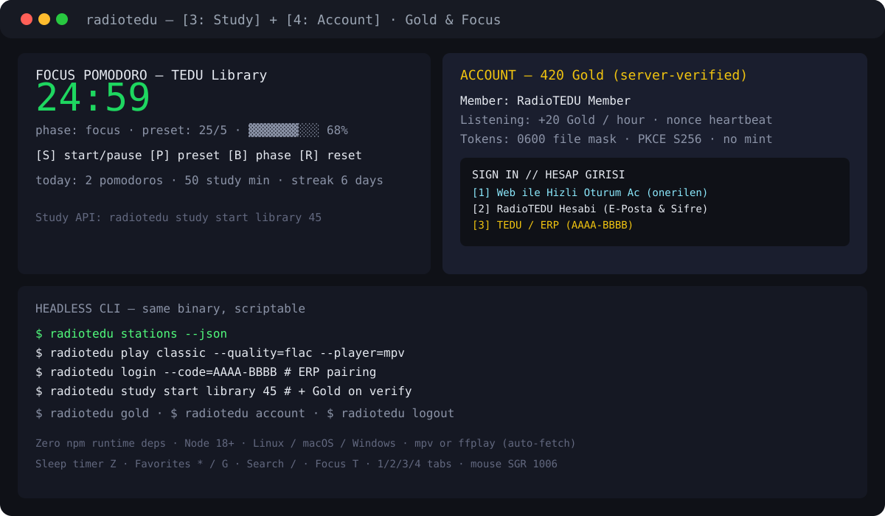

<div align="center">

# 📻 radiotedu-tui

**Spotify-TUI esintili terminal istemcisi — 32-bant gerçek zamanlı ses spektrumu, Focus Pomodoro salonu, sunucu-doğrulamalı Gold dinleme motoru ve kampüs Study arkadaşı.**

**The Spotify-TUI inspired terminal client, 32-band real-time audio spectrum visualizer, Focus Pomodoro lounge, server-verified Gold listening engine, and campus Study companion for RadioTEDU.**

[](package.json)
[](https://github.com/radiotedu/radiotedu-tui/actions/workflows/ci.yml)
[](test/)
[](https://radiotedu.com)
[](https://nodejs.org)
[](https://github.com/radiotedu/radiotedu-tui)
[-orange.svg?style=flat-square)](https://mpv.io)
[-success.svg?style=flat-square)](package.json)
[](LICENSE)

[🚀 Quick Start](#-installation--quick-start) •
[📸 Screenshots](#-screenshots) •
[🎨 Interface](#-interface-layout) •
[⌨️ Controls](#️-keyboard-shortcuts--controls) •
[🖱️ Mouse](#-mouse-controls) •
[📻 Stations & FLAC](#-stations--stream-qualities) •
[🔐 Auth & SSO](#-authentication--erp-sso) •
[⚡ CLI](#-headless-cli-commands) •
[🧪 Tests](#-testing--code-quality) •
[📂 Structure](#-project-structure)

</div>

---

## 📸 Screenshots

> Tüm görseller `docs/screenshots/` altındadır. Uçbirimde **Cascadia Mono** veya **JetBrains Mono** kullanın; uygulama host fontuna saygı duyar.

### 1 — Stations Dashboard (`[1: Stations]`)



- Sol: 9 kanal, tek kolon, yumuşak seçim vurgusu.
- Sağ: canlı spektrum + stream bilgisi (codec, engine, buffer).
- Alt: sabit playback footer — ilerleme çubuğu, ses kaydırıcısı, aksiyon hapları.

### 2 — Fullscreen Visualizer (`[2: Visualizer]` + `v`)



- 32-bant `cava` tarzı ekolayzer: sub-bass / mid / tiz simülasyonu.
- Peak-hold decay noktaları + frekans ekseni (`60Hz` → `16kHz`).
- `v` ile fullscreen, `Tab` ile panel odağı.

### 3 — Study + Account (`[3: Study]` / `[4: Account]`)



- Focus Pomodoro (25/5, 50/10), TEDÜ Kütüphane / Çim Alan Study takibi.
- Server-verified Gold (+20 / saat), PKCE cihaz eşleştirme, maskeli parola.
- Aynı binary headless CLI olarak da çalışır (`stations`, `play`, `login`, `study`, `gold`).

---

## 🌟 Overview

`radiotedu-tui`, [Rigellute/spotify-tui](https://github.com/Rigellute/spotify-tui) estetiğini ve modern OpenCode / Catppuccin paletini terminalinize taşır. Kampüs canlı yayınlarını dinleyin, Classical ve Jazz kanallarında **Lossless 24-bit FLAC** keyfi sürün, gerçek zamanlı animasyonlu ekolayzeri izleyin, TED Üniversitesi kampüs alanlarında Study & Focus Pomodoro takip edin ve sunucu-doğrulamalı RadioTEDU Gold kazanın — tamamı **sıfır harici npm runtime bağımlılığı** ile.

### Key Highlights

- 🎛️ **Multi-Pane TUI Dashboard**: Sekmeli arayüz (`[1: Stations]`, `[2: Visualizer]`, `[3: Study & Lyrics]`, `[4: Account]`), her terminal ölçüsüne akıcı uyum.
- 📊 **32-Band Audio Spectrum Visualizer**: Çok oktavlı harmonik ekolayzer, peak-hold noktaları, etiketli frekans ekseni.
- 🎵 **Pristine Audio Streaming**: **FLAC 24-bit Hi-Fi**, HE-AAC v2, AAC-LC, MP3 ve Ogg/Opus.
- 🔊 **Zero-Config Audio Auto-Download**: `mpv` veya `ffplay` otomatik bulunur; yoksa ilk açılışta hafif ses-only `ffplay` indirilir (Windows & Linux, onaylı).
- 🖱️ **Full Mouse & Keyboard**: Native 1006 SGR mouse (sekmeye tıkla, istasyona tıkla-çal, ses kaydırıcısı, hap butonlar) + klavye.
- 🔍 **Listening Tools** (`src/listening.js`, `rtai-mobile/terminal` v1.3.11'den): `/` arama, `*`/`G` favoriler (`listening-preferences.json`, kimlikten izole), `Z` uyku zamanlayıcı (15/30/60/90/kapalı, deadline tabanlı, duraklatılmış akışı asla devam ettirmez), `?` klavye rehberi, `T` Focus.
- 🔐 **Secure Dual Auth**: İnteraktif modal ile RadioTEDU hesabı + 8-karakter ERP cihaz kodu (`AAAA-BBBB`), RFC 7636 PKCE S256.
- 🪙 **Server-Verified Gold**: Dönen nonce + heartbeat ile dinleme kanıtı — client-side mint yok (+20 Gold / saat).
- 📚 **Focus & Study**: 25/5 ve 50/10 Pomodoro + TEDU Library / Çim Alan Study, hesap istatistiklerine bağlı.
- 🧩 **Platform Bridges** (`lib/`): Windows SMTC, Linux MPRIS, birleşik media-controls dispatcher, DSP loudness normalizasyonu (EBU R128), stream diagnostics, Wrapped özeti.
- ⚡ **Ultra-Lightweight**: Linux, macOS, Windows; Node.js 18+ standart API'ler, 0 npm şişkinliği.

---

## 🎨 Interface Layout

```text
╭─ 📻 RADIOTEDU // LIVE DASHBOARD v1.4.4 ────────────────────────────────────────── [👤 RadioTEDU Member  ◆ 420 Gold] ─╮
│  [1: Stations]   2: Visualizer   3: Study & Lyrics   4: Account                                               │
├───────────────────────────────────┬───────────────────────────────────────────────────────────────────────────┤
│ STATIONS (9 CHANNELS)             │ LIVE AUDIO SPECTRUM & STREAM INFO                                         │
│                                   │                                                                           │
│   ● RadioTEDU     Flagship Main   │       •               •               •                                   │
│   ● Classical     Symphonic [FLAC]│     █ █ █           █ █ █           █ █ █           █ █                   │
│ ▸ ● Jazz          Bebop     [FLAC]│     █ █ █ █       █ █ █ █ █       █ █ █ █ █       █ █ █ █                 │
│   ● Lo-Fi         Chillhop Beats  │   █ █ █ █ █ █   █ █ █ █ █ █ █   █ █ █ █ █ █ █   █ █ █ █ █ █               │
│   ● Energize      Workout EDM     │   █ █ █ █ █ █ █ █ █ █ █ █ █ █ █ █ █ █ █ █ █ █ █ █ █ █ █ █ █ █ █           │
│   ● Rock          Classic & Alt   │   60Hz 125Hz 250Hz  500Hz  1kHz   2kHz   4kHz   8kHz  16kHz               │
│   ● English       Campus English  │                                                                           │
│   ● Français      Campus French   │   Station : Jazz (FLAC) · 24-bit 96kHz Lossless                           │
│   ● Voting        Audience Vote   │   Track   : Miles Davis - So What                                         │
│                                   │   Engine  : mpv · Buffer Healthy · Normal Latency                         │
├───────────────────────────────────┴───────────────────────────────────────────────────────────────────────────┤
│ NOW PLAYING: Miles Davis - So What                                                                            │
│ 04:12 ━━━━━━━━━━━━━━━━━━━━━━━━━━━━━━━━━━●────────────────────────────────────────────── 60:00 [● LIVE]        │
│                                                                                                               │
│   [Space] Pause   [F] FLAC   [+] Vol+   [-] Vol-   [L] Login   [S] Study   [Q] Quit     🔉 [████████░░] 80%    │
╰───────────────────────────────────────────────────────────────────────────────────────────────────────────────╯
```

Tasarım notları: kömür grisi zemin, sıcak beyaz metin, ölçülü mercan vurgusu. Her genişlikte tek kolon istasyon listesi, seçimde yumuşak vurgu, aktif sekmede renkli alt çizgi, navigasyon ile sabit footer arasında ince çizgiler. İkincil kontroller ilgili görünümde kalır. Düzen terminal ölçüsünü takip eder, seçimi görünür alana kaydırır ve çıkışta shell'i geri yükler. Audio görünümü seçili stream formatını ve player durumunu raporlar; sinyal gücü / bit derinliği / canlı spektrum ölçümü iddia etmez. Gold sunucudan gelir; yerel focus zamanlayıcıyı bitirmek ödül üretmez.

---

## 🚀 Installation & Quick Start

### Prerequisites

1. **Node.js**: Version 18.0.0 or higher.
2. **Audio Player Engine**: `mpv` (önerilen) veya `ffplay`. *(Bulunamazsa `radiotedu-tui` ilk açılışta onayınızla hafif `ffplay` indirir — Windows & Linux).*

---

### Option 1: Windows Installation (CMD & PowerShell)

```bash
npm install -g https://radiotedu.com/tui/radiotedu-tui.tgz
```
*(Node.js yoksa: `winget install OpenJS.NodeJS.LTS`)*

Alternatif PowerShell:

```powershell
irm https://radiotedu.com/install.ps1 -OutFile install.ps1; .\install.ps1
```

---

### Option 2: Linux & macOS Installation

```bash
curl -sSL https://radiotedu.com/install.sh | bash
# or from GitHub:
curl -fsSL https://raw.githubusercontent.com/radiotedu/radiotedu-tui/main/install.sh | bash
```

---

### Option 3: Universal npm / Git Install

```bash
npm install -g git+https://github.com/radiotedu/radiotedu-tui.git
```

---

### Option 4: Run Directly from Source

```bash
git clone https://github.com/radiotedu/radiotedu-tui.git
cd radiotedu-tui
node src/index.js
# veya: npm start
# veya shim: node bin/index.js
```

---

### Launching the Player

```bash
radiotedu
# or
radiotedu-tui
```

Gold için RadioTEDU / TEDÜ ERP eşleştirme (+20 Gold / saat):

```bash
radiotedu login
# veya https://radiotedu.com/erp/device adresindeki 8-haneli kodla:
radiotedu login --code=AAAA-BBBB
```

---

## ⌨️ Keyboard Shortcuts & Controls

### Navigation & Views

| Shortcut | Action |
| :--- | :--- |
| `1` | **Tab 1: Stations & Spectrum** |
| `2` | **Tab 2: Fullscreen Audio Visualizer** |
| `3` | **Tab 3: Campus Study Timer & Lyrics** |
| `4` | **Tab 4: Account & Gold Balance** |
| `Tab` | Panel odağını döndür |
| `v` | Fullscreen visualizer aç/kapat |

### Playback & Audio

| Shortcut | Action |
| :--- | :--- |
| `↑` / `↓` or `k` / `j` | İstasyon imleci |
| `Enter` | Seçili istasyonu hemen çal |
| `Space` or `p` | Oynat / Duraklat |
| `+` / `-` or `=` / `_` | Ses ±%5 |
| `m` | Sessiz aç/kapat |
| `f` | Kalite döngüsü (`Normal` ↔ `Low` ↔ `FLAC`) |

### Listening Tools (legacy 1.3.11 motoru, `src/listening.js`)

| Shortcut | Action |
| :--- | :--- |
| `/` | İstasyon adı/açıklamasında ara; `Enter` bitirir, `Esc` temizler |
| `*` | Favori ekle/çıkar; `G` tümü/favoriler görünümü (`listening-preferences.json`) |
| `Z` | Uyku zamanlayıcı: 15 → 30 → 60 → 90 → kapalı (süre dolunca duraklatır, asla devam ettirmez) |
| `?` | Klavye rehberi |
| `T` | Focus zamanlayıcıyı başlat/duraklat |

### Account & Session

| Shortcut | Action |
| :--- | :--- |
| `l` | Giriş modalı (RadioTEDU veya TEDÜ ERP SSO) |
| `x` | Temiz çıkış (sign out) |
| `a` | Hesap + Gold bakiyesini yenile |
| `s` | Focus & Study oturumu başlat/durdur |
| `q` or `Ctrl+C` | Sesi durdur, temiz çık |

---

## 🖱️ Mouse Controls

SGR 1006 mouse:

- **Sekmeler**: `[1: Stations]`, `[2: Visualizer]`, `[3: Study & Lyrics]`, `[4: Account]` tıklanabilir.
- **Çal**: İstasyon satırına tıkla → anında akort.
- **Kaydır**: İstasyon panelinde tekerlek ile yumuşak kaydırma.
- **Oynat/Duraklat**: Parça metasına veya playbar'a tıkla.
- **Ses**: `[████████░░]` çubuğunda tıkladığın seviyeye atla.
- **Haplar**: `[Space]`, `[F]`, `[+]`, `[-]`, `[L]`, `[S]`, `[Q]` tıklanabilir.

---

## 📻 Stations & Stream Qualities

9 resmi mount, çok kaliteli fallback + odyofil lossless:

| Station | Genre / Purpose | Qualities | Default Codec | Lossless FLAC |
| :--- | :--- | :--- | :--- | :---: |
| **RadioTEDU** | Flagship Campus Channel | `Normal`, `Low` | HE-AAC v2 | — |
| **Classical** | Symphonic, Concerto & Chamber | `Normal`, `Low`, `FLAC` | FLAC 24-bit | ✅ **24-bit Hi-Fi** |
| **Jazz** | Bebop, Soul, Swing & Modern Jazz | `Normal`, `Low`, `FLAC` | FLAC 24-bit | ✅ **24-bit Hi-Fi** |
| **Lo-Fi** | Chillhop Beats for studying | `Normal`, `Low` | HE-AAC v2 | — |
| **Energize** | High-tempo workout & EDM | `Normal`, `Low` | HE-AAC v2 | — |
| **Rock** | Classic Rock & Alternative | `Normal`, `Low` | HE-AAC v2 | — |
| **English** | International Campus Broadcast | `Normal` | MP3 192k | — |
| **Français** | French Language Broadcast | `Normal` | MP3 192k | — |
| **Voting** | Interactive live listener-voted stream | `Normal` | Ogg/Opus | — |

> 💡 **Tip**: `f` veya `[F]` ile kalite döngüsü. Ölçülü bağlantıda `FLAC` öncesi onay istenir.

---

## 🔐 Authentication & ERP SSO

Birleşik giriş: otomatik tarayıcı cihaz eşleştirme, e-posta/parola, TEDÜ ERP SSO:

```text
╭─ 🔐 RADIOTEDU SIGN IN // HESAP GİRİŞİ ────────────────────────╮
│  Lütfen oturum açma yöntemini seçin:                         │
│                                                              │
│  [1] 🌐 Web ile Hızlı Oturum Aç (Otomatik Onay)              │
│  [2] 📧 RadioTEDU Hesabı (E-Posta & Şifre)                   │
│  [3] 🏛️ TEDÜ / ERP Girişi (8 Haneli Kod: AAAA-BBBB)          │
│                                                              │
│  ──────────────────────────────────────────────────────────  │
│  Klavyeden [1], [2] veya [3]'e basın  ·  [Esc] İptal         │
╰──────────────────────────────────────────────────────────────╯
```

### 1. Web ile Hızlı Oturum Aç (Önerilen)
`1` → benzersiz cihaz kodu üretilir, `https://radiotedu.com/device?code=ABCD-EFGH` tarayıcıda açılır → tek tık **"Cihazı Onayla"** → terminal JWT'leri kaydeder, Gold yüklenir. Hesabın yoksa aynı sayfada saniyeler içinde oluşturulur.

### 2. RadioTEDU Hesabı (E-Posta & Şifre)
`2` → terminalde maskeli parola ile giriş.

### 3. TEDÜ / ERP Kodu
`3` → `https://radiotedu.com/erp/device` ekranındaki 8-haneli kodu gir.

### Security Architecture

- **RFC 7636 PKCE (S256)**: SHA-256 code challenge, interception koruması.
- **0600 Token Storage**: Yerel profil deposu, sıkı dosya izinleri.
- **Nonce Heartbeat**: Gold/Study ödülleri backend'de dönen nonce ile doğrulanır.

---

## ⚡ Headless CLI Commands

İnteraktif TUI dışında scriptlenebilir CLI:

```bash
radiotedu stations
radiotedu stations --json
radiotedu play classic --quality=flac --player=mpv
radiotedu play lofi --quality=low
radiotedu login
radiotedu login --tedu
radiotedu login --code=AAAA-BBBB
radiotedu account
radiotedu gold
radiotedu study start library 45
radiotedu study status
radiotedu study stop
radiotedu logout
radiotedu help
radiotedu --version
```

---

## 🧪 Testing & Code Quality

```bash
npm test       # node --test → 29 passed, 1 skipped
npm run check  # tüm src/ + lib/ + bin/ için node --check
```

### Coverage

- `✔ login, Gold balance and verified listening use existing production contracts`
- `✔ quality mounts match RadioTEDU contract`
- `✔ Voting stays last and uses its single live mount`
- `✔ ffplay/mpv/vlc args + Windows candidate paths`
- `✔ Gold balance only accepts a non-negative server integer`
- `✔ station aliases keep cazz as the public mount`
- `✔ keyboard and SGR mouse input are recognized`
- `✔ device pairing code 8-char 4-4 hyphen`
- `✔ all views fit narrow/standard/wide windows`
- `✔ scrolled click selects visible station`
- `✔ empty space is not a selection target`
- `✔ Unicode/hostile metadata sanitized`
- `✔ credential view masks passwords`
- `✔ search ignores accents, sleep deadline, favorites isolated from auth`
- `✔ PKCE S256 RFC 7636 vector + round-trip + 10-min expiry + URL validator + ERP exchange`

Legacy not: `test/listening.test.js` içindeki 1.3.11 TUI-entegrasyon vakası v1.4.4 visualizer mimarisinde `skip` — saf arama/uyku/favori mantığı tam testli.

---

## 📂 Project Structure

```text
radiotedu-tui/
├── README.md                 # Bu dosya — kurulum, ekran görüntüleri, kontroller
├── CHANGELOG.md              # Sürüm geçmişi (1.3.11 → 1.4.4)
├── CONTRIBUTING.md           # Katkı kuralları
├── SECURITY.md               # Güvenlik politikası
├── package.json              # Manifest, bin (radiotedu/radiotedu-tui), scripts
├── install.sh                # Linux/macOS tek-satır kurulum
├── install.ps1               # Windows PowerShell kurulum
├── LICENSE                   # MIT
├── .github/workflows/ci.yml  # Node 18/20/22 × ubuntu/macos/windows
├── .gitignore / .gitattributes
├── bin/
│   └── index.js              # CLI shim → src/index.js (rtai-mobile/terminal'den)
├── lib/                      # Platform köprüleri (rtai-mobile/terminal'den)
│   ├── index.js              # SMTC + MPRIS + DSP + Wrapped + Diagnostics facade
│   ├── smtc.js               # Windows System Media Transport Controls
│   ├── mpris.js              # Linux MPRIS D-Bus stub/spec
│   ├── media-controls.js     # Birleşik dispatcher (play/pause/next/prev/stop)
│   ├── dsp.js                # EBU R128 loudness normalizasyonu
│   ├── diagnostics.js        # Stream health / bitrate / buffer snapshot
│   └── wrapped.js            # RadioTEDU Wrapped özeti
├── src/
│   ├── index.js              # CLI router, argümanlar, TUI orkestrasyonu
│   ├── tui.js                # v1.4.4 visualizer dashboard (render, mouse, modal)
│   ├── layout.js             # v1.3.11 responsive frame builder (mouse hit-targets)
│   ├── listening.js          # v1.3.11 arama/favori/uyku motoru
│   ├── player.js             # mpv/ffplay lifecycle, portable fetch
│   ├── stations.js           # Kayıt, mount, codec, alias (cazz)
│   ├── api.js                # Auth, ERP, Gold, Study REST istemcisi
│   ├── gold.js               # Nonce-verified listening heartbeat
│   ├── pkce.js               # RFC 7636 S256 + secure pending store
│   ├── metadata.js           # Icecast ICY okuyucu
│   └── store.js              # Token/study/preferences (0600), session state
├── test/
│   ├── api.test.js
│   ├── core.test.js
│   ├── layout.test.js        # Dar/standart/geniş pencere, sanitizasyon
│   ├── listening.test.js     # Arama/uyku/favori (1 legacy skip)
│   └── pkce.test.js
└── docs/
    └── screenshots/
        ├── stations.svg      # [1: Stations] dashboard
        ├── visualizer.svg    # [2: Visualizer] fullscreen
        └── account-study.svg # [3/4] Study + Account + CLI
```

Kaynak: çekirdek TUI `https://github.com/radiotedu/rtai-mobile/tree/main/terminal` (v1.3.11) → bu repo v1.4.4 visualizer mimarisiyle birleştirildi; üzerine `lib/`, `bin/`, `layout`/`listening`, testler ve dokümantasyon eklendi.

---

## 📻 Organization & Community

**RadioTEDU** tarafından geliştirilir ve bakımı yapılır:

- **Website**: [radiotedu.com](https://radiotedu.com)
- **Repository**: [radiotedu/radiotedu-tui](https://github.com/radiotedu/radiotedu-tui)
- **Kaynak TUI**: [radiotedu/rtai-mobile/tree/main/terminal](https://github.com/radiotedu/rtai-mobile/tree/main/terminal)
- **Organization**: RadioTEDU Ankara Studios · TED University ([radiotedu.com](https://radiotedu.com))

---

## 📄 License

**MIT License** — ayrıntılar için [LICENSE](LICENSE) dosyasına bakın.
Copyright (c) 2026 RadioTEDU (RadioTEDU Ankara Studios & TED University).
